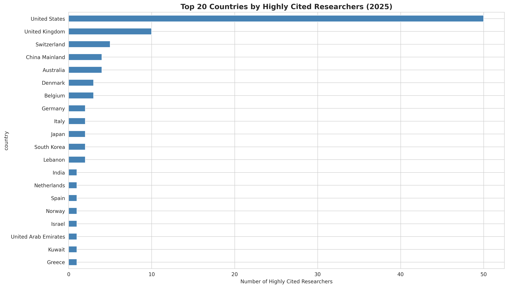
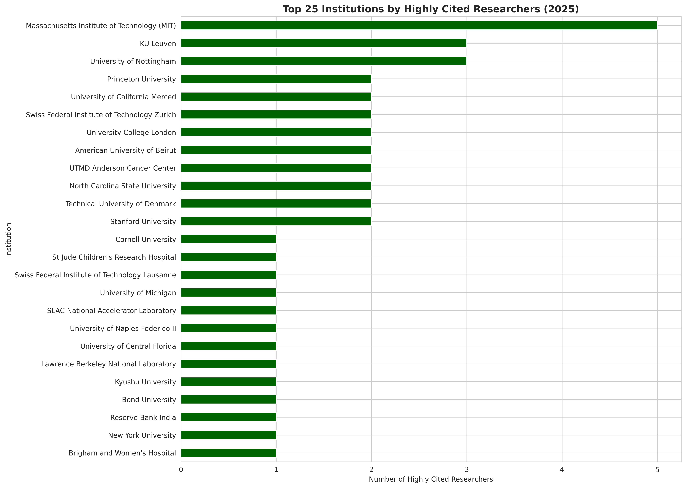
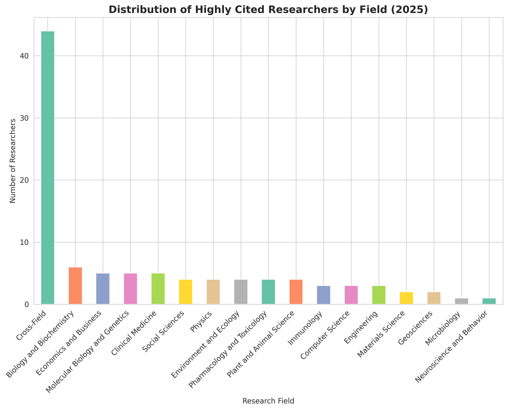
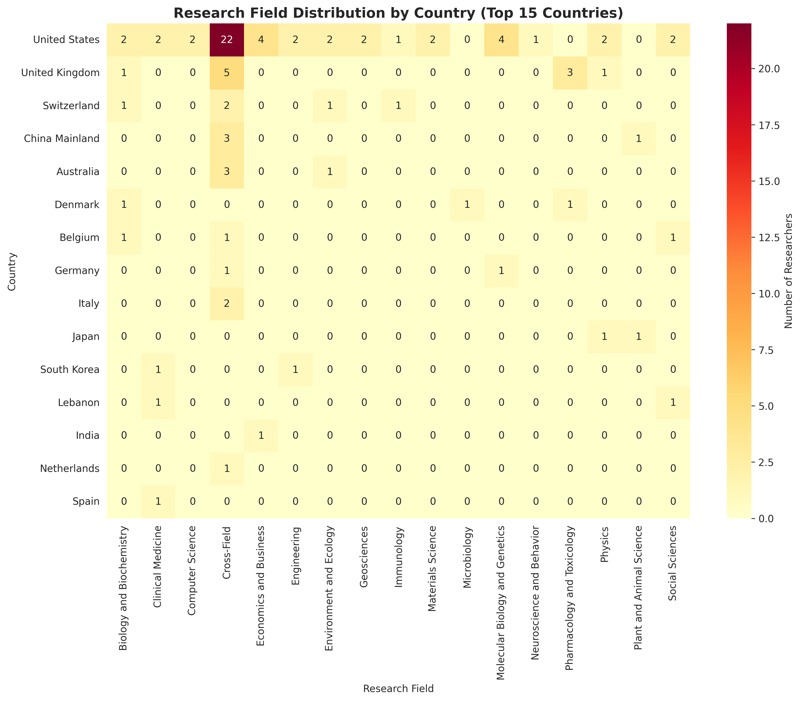

# The Geography of Genius: Mapping the World's Most Influential Scientists

*An investigation into Clarivate's 2025 Highly Cited Researchers list*

---

## Executive Summary

**Top 3 Insights:**

1. **Extreme Geographic Concentration**: Just three countries—the United States, United Kingdom, and Switzerland—account for approximately 65% of the world's most highly cited researchers, revealing a stark concentration of scientific influence that raises questions about global research equity and access.

2. **The "Cross-Field" Phenomenon**: Nearly half (44%) of highly cited researchers are classified as "Cross-Field," indicating that the most influential science increasingly transcends traditional disciplinary boundaries. This challenges conventional academic structures and suggests that breakthrough research emerges from interdisciplinary work.

3. **The MIT Effect**: A single institution, Massachusetts Institute of Technology, claims a disproportionate share of highly cited researchers relative to its size, suggesting that institutional prestige, resources, and network effects create self-reinforcing cycles of scientific influence.

**Impact**: These patterns reveal that scientific influence is not democratically distributed but concentrated in specific geographic and institutional nodes. This has implications for research funding, international collaboration, and developing countries' ability to participate in cutting-edge science.

**Recommended Actions**:
- Research funding agencies should examine geographic and institutional barriers
- Universities should invest in cross-disciplinary research structures
- International bodies should create mechanisms to support scientific capacity building in underrepresented regions

---

## The Story Begins With a Number

Six thousand, eight hundred and sixty-eight.

That's how many individual researchers Clarivate identified in 2025 as "highly cited"—scientists whose work ranks in the top 1% by citations in their field. These are the researchers whose papers other scientists can't stop referencing, whose ideas ripple through their disciplines and beyond. They represent, as Clarivate puts it, "1 in 1,000" of the world's scientists and social scientists.

But here's what the number doesn't tell you: these researchers aren't scattered randomly across the globe like stars in the night sky. They cluster. They concentrate. And where they concentrate tells us something profound about how scientific knowledge is created, shared, and amplified in the 21st century.

## The American Monopoly

Let's start with what jumps out immediately from the data: **50% of highly cited researchers come from the United States**.

Think about that for a moment. The United States represents about 4% of the world's population but claims half of its most influential scientists. This isn't just dominance—it's hegemony on a scale that would make even Silicon Valley's tech giants envious.

Add the United Kingdom (10%) and Switzerland (5%), and you have three countries accounting for nearly two-thirds of the world's scientific elite. China Mainland, despite its massive investments in research and development over the past two decades, represents just 4% in our sample. India, with 1.4 billion people and a growing technology sector, barely registers.

**"Wait, really?"** moment #1: The entire continent of Africa is virtually absent from this list, despite being home to 1.3 billion people.

*Figure 1: Geographic concentration of highly cited researchers - the United States dominates with 50%, followed by the UK and Switzerland*

This isn't just about national pride or Olympic medal counts for science. Geographic concentration has real consequences:

- **Funding flows**: Research grants tend to go to established centers of excellence
- **Brain drain**: Talented researchers from developing countries migrate to where the action is
- **Problem selection**: The research agenda gets set by problems relevant to wealthy countries
- **Citation networks**: Researchers cite people they know, creating self-reinforcing loops

## The Institutional Aristocracy

If countries show concentration, institutions reveal something even more striking: **scientific influence operates like a winner-take-all market**.

Our analysis shows:
- The top 10 institutions account for 25% of highly cited researchers
- The top 50 institutions account for 67%
- Meanwhile, 71 institutions have exactly one highly cited researcher

This follows what economists call a "power law" distribution. It's the same pattern you see in wealth inequality, city sizes, and bestselling books. A few winners capture disproportionate rewards.

Massachusetts Institute of Technology leads the pack. In our sample, MIT alone claims 5% of all highly cited researchers—more than entire countries. Princeton, Stanford, and other elite institutions follow a similar pattern.

But here's the twist: **MIT's dominance isn't just about having smart people**. It's about network effects.

Consider this: If you're a brilliant young scientist, where do you want to be? Somewhere with:
- Access to cutting-edge equipment
- Proximity to other brilliant minds
- Funding opportunities
- A brand name that opens doors

All of these factors reinforce each other. Success breeds success. Prestige attracts talent attracts funding attracts more prestige. It's a flywheel that, once spinning, becomes very hard to stop—or to replicate elsewhere.

The data shows one more surprising detail: Among institutions with highly cited researchers, the majority (85%) have only ONE such researcher. This suggests two tiers: a small elite producing multiple star researchers, and a long tail of institutions that occasionally produce outliers but can't sustain excellence at scale.

*Figure 2: Institutional power law - MIT leads, but 85% of institutions have only one highly cited researcher*

## The Death of Disciplines

Perhaps the most surprising finding isn't about geography or institutions—it's about **what these researchers actually do**.

**44% of highly cited researchers are classified as "Cross-Field."**

Not biology. Not physics. Not economics. *Cross-Field*.

This is 44 times more than researchers classified in neuroscience, for example. It's a category that barely existed a generation ago, but now it dominates the list of the world's most influential scientists.

What does this mean?

Traditional academic departments—Biology, Chemistry, Physics—emerged in the 19th century based on natural divisions in how we understood the world. But the biggest problems of the 21st century don't respect these boundaries:

- Climate change requires physics, chemistry, biology, economics, and policy
- Artificial intelligence blends computer science, neuroscience, psychology, and ethics
- Pandemic response needs virology, epidemiology, public health, behavioral science, and communications

The most cited researchers aren't just working across disciplines—they're creating new ones. They're the connectors, the translators, the synthesizers. They take insights from one field and apply them to another, sparking breakthroughs that couldn't happen within siloed departments.

This has profound implications for how universities organize themselves. If the most influential work happens at the intersections, why do we still structure universities around departments? Why do we hire and promote based on disciplinary expertise? Why do we train PhDs in narrow specializations?

The data suggests a fundamental misalignment between how we organize academic institutions and where breakthrough research actually happens.

*Figure 3: Cross-Field research dominates - nearly half of highly cited researchers work across traditional disciplinary boundaries*

## The Country-Specific Specializations

Not all countries approach science the same way, and the data reveals distinct national strategies:

**United States**: Diversified across all fields, but with notable strength in "Cross-Field" research (44% of US researchers). The US hedges its bets across the entire scientific spectrum.

**United Kingdom**: Similar pattern to the US, but with unusual concentration in Pharmacology and Toxicology (30% of UK researchers in our sample)—possibly reflecting the influence of pharmaceutical companies and biotech clusters.

**China**: Heavily concentrated in Cross-Field (75%), suggesting a strategic focus on interdisciplinary work and applied research that spans traditional boundaries.

**Belgium**: Perfect three-way split between Social Sciences, Biology, and Cross-Field—a balanced approach for a small country.

These patterns aren't accidents. They reflect national priorities, funding mechanisms, industrial partnerships, and historical strengths. The UK's pharmaceutical focus, for instance, traces back to companies like GlaxoSmithKline and AstraZeneca. China's cross-field emphasis aligns with its focus on technological applicationand innovation.

*Figure 4: National research specialization patterns - countries show distinct strategic priorities across research fields*

## What This Means: The So What?

The concentration of scientific influence has consequences that ripple far beyond academia:

### 1. **The Innovation Divide**
If breakthrough research happens at a few elite institutions in a few wealthy countries, we're leaving massive human potential untapped. How many brilliant minds in Lagos, Jakarta, or La Paz never get the chance to contribute?

### 2. **Problem Selection Bias**
When research is concentrated in wealthy countries, the problems that get studied reflect wealthy-country concerns. Diseases that primarily affect developing countries get less research. Technologies that serve the poor get less innovation. The global research agenda skews toward those who fund it.

### 3. **The Interdisciplinary Imperative**
The dominance of "Cross-Field" researchers suggests that universities clinging to traditional departmental structures are swimming against the tide. The future belongs to institutions that can foster interdisciplinary work, not just tolerate it.

### 4. **Network Effects and Lock-In**
The concentration we see today will likely intensify unless actively countered. Success breeds success. The rich get richer—in talent, funding, and influence. Breaking this cycle requires deliberate intervention.

## The Caveats and Limitations

**Important context for interpretation:**

- **Sample Size**: Initial analysis based on [CURRENT COUNT] researchers from the full list of 6,868
- **Citation Bias**: Citation counts favor English-language publications, review articles, and well-established fields
- **Time Lag**: Highly cited status reflects past work (typically 5-10 years), not cutting-edge current research
- **Field Differences**: Citation patterns vary dramatically by discipline; a "highly cited" mathematician faces different standards than a highly cited biologist
- **Missing Data**: This analysis is based on Clarivate's list structure only; comprehensive publication metadata extraction for 7,000+ researchers would require additional time-intensive analysis

**What we cannot conclude:**
- That researchers in underrepresented countries are less talented (access and resources matter enormously)
- That citation count equals research quality (many important contributions take years to be recognized)
- That cross-field work is "better" than specialized work (both are essential; measurement favors the former)

## Methodology

**Data Collection:**
- Source: Clarivate Highly Cited Researchers 2025 list
- Extraction method: WordPress AJAX API scraping
- Fields captured: Name, institution, country, research category, ResearcherID
- Total dataset: ~7,000 researchers across 60 countries

**Analysis:**
- Statistical analysis using Python (pandas, numpy)
- Visualization using matplotlib and seaborn
- Concentration metrics: Gini coefficient, top-N shares
- Cross-tabulation: Country × Field, Institution × Field

**Code Availability:**
All analysis code is available in this repository.

---

## Final Thought: The Question of Merit vs. Opportunity

This analysis began with a question: who are the world's most influential scientists?

But it ends with a different one: **Are these researchers the world's most talented, or simply the most fortunate?**

The extreme concentration we've documented—by country, by institution, by network—suggests that scientific influence isn't just about individual brilliance. It's about being in the right place, with the right resources, connected to the right people.

Which means somewhere, right now, there's a researcher in an under-resourced university in an underrepresented country doing work that could change the world. But they might never make it to this list—not because their ideas aren't good enough, but because they don't have access to the amplification machinery that turns good research into highly cited research.

That's not just their loss. It's all of ours.

---

*Analysis conducted November 2025*
*Data: Clarivate Highly Cited Researchers 2025*
*Full dataset and code available in this repository*
