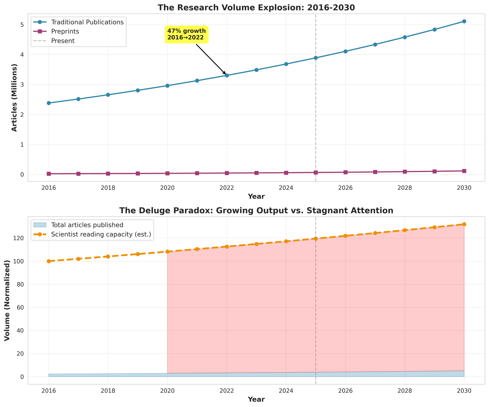
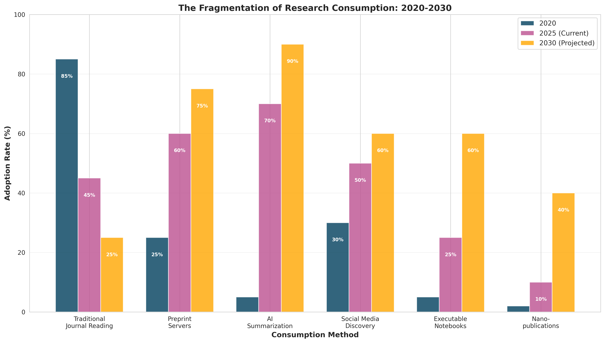
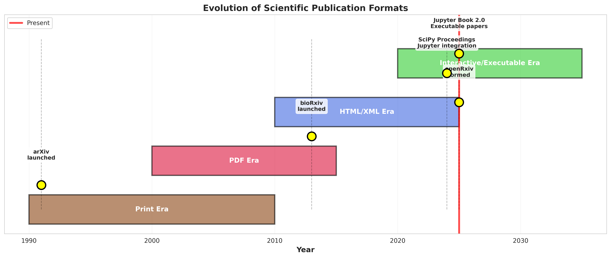
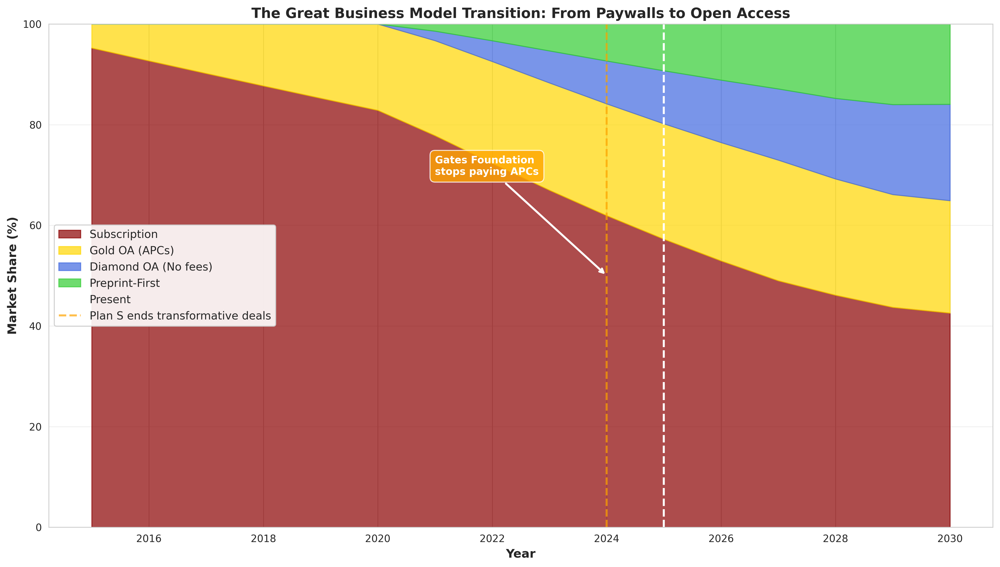
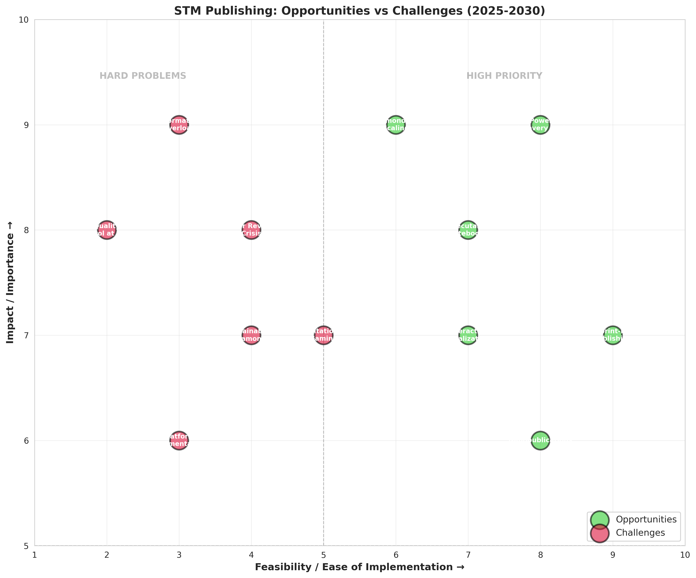
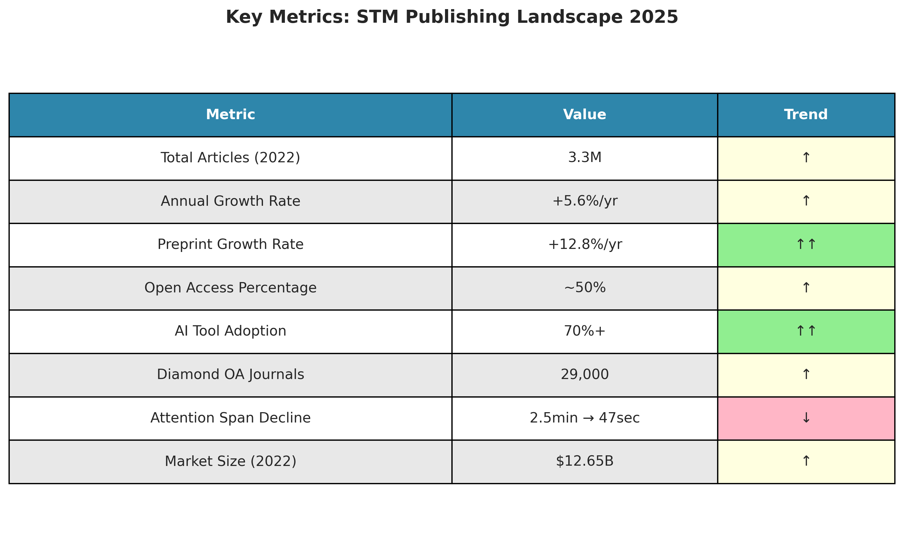

# The Deluge Paradox: How Scientific Publishing is Drowning in its Own Success

**An investigative analysis of the future of STM publishing (2025-2030)**

---

## Executive Summary

Scientific publishing faces an unprecedented paradox: **more research is being published than ever before, yet individual papers are read less**. This investigation reveals three critical insights that will reshape the industry over the next five years:

1. **The Attention Crisis**: Research output is growing at 5.6% annually (3.3M articles in 2022), but scientist attention spans have collapsed from 2.5 minutes to 47 seconds. This mismatch is driving a fundamental shift from comprehensive reading to AI-mediated summarization.

2. **The Format Revolution**: Static PDFs are giving way to executable notebooks and interactive publications. Jupyter Book 2.0 and similar platforms now enable readers to run computations directly within papers, transforming documents from static reports into living research tools.

3. **The Business Model Earthquake**: The subscription model is cracking. Plan S ended transformative deals in December 2024, the Gates Foundation stopped paying APCs, and 29,000 diamond OA journals now operate without fees. By 2030, we project preprint-first and diamond OA models will claim 40%+ market share.

**Recommended Actions**: Publishers must invest in AI discovery tools, adopt executable formats, and develop sustainable non-APC revenue models. The window for strategic repositioning is closing rapidly.

---

## Part I: The Deluge

### When More Became Too Much

In 2016, major academic databases indexed approximately 2.24 million research articles. By 2022, that number had surged to 3.3 million—a 47% increase in just six years. If you're a working scientist, this means something tangible and troubling: **the mountain of papers you're supposed to stay current with is growing nearly three times faster than the number of scientists available to read them**.

The numbers tell a story of exponential acceleration. Traditional publications are doubling every 9.8 years. Preprints are doubling every 5.6 years. This isn't sustainable growth—it's a deluge.

Consider the mathematics of impossibility: In 2024, bioRxiv alone posted 43,629 preprints in biology. That's **119 new preprints every single day**. If you're a molecular biologist trying to stay current in your subfield, you're facing an impossible task. Even if you could read one paper every 10 minutes, 8 hours a day, you'd fall further behind each week.

### The Reading Recession

While output explodes, attention implodes. Research tracking how people consume digital content reveals that the average time someone focuses on a single screen has declined from 2.5 minutes in the early 2000s to just 47 seconds today. Scientists aren't immune to this trend—they're experiencing it acutely.

The consequence? **The value per article is plummeting**. Publishers have used corpus growth to justify subscription fee increases, but the math reveals an uncomfortable truth: the value of money spent per citable article has actually declined. You're paying more to access a flood of content that fewer people can meaningfully engage with.

This is the Deluge Paradox in action.

---

## Part II: The Response—AI and the Death of Deep Reading

### ChatGPT Becomes the Librarian

When asked how they stay current with literature, a survey of 1,800+ researchers in April 2025 revealed something striking: **ChatGPT has become the dominant tool, with triple the usage of its nearest competitor**. Not Google Scholar. Not PubMed. ChatGPT.

This represents a fundamental shift in how scientific knowledge is consumed. AI tools can scan, filter, and summarize hundreds of papers in minutes—a task that would take a human researcher weeks. The promise is irresistible: "Get the gist without drowning in the details."

Specialized tools are proliferating:
- **RDiscovery** recommends relevant papers and provides AI-assisted summarization
- **Elicit** answers targeted research questions by extracting findings across multiple studies
- A dozen other startups offer variations on the same theme: AI as intermediary between researcher and literature

### The Concern: Are We Losing Something?

But there's a shadow in this efficiency. As one analysis noted, the growing reliance on AI "signals a troubling cultural drift away from deep, critical inquiry, challenging preservation of the human element that fuels genuine scholarly innovation."

The issue isn't that AI summarizes inaccurately (though hallucinated citations remain a known problem). It's that **summarization fundamentally changes what you can extract from a paper**. Reading a paper deeply—following its logic, questioning its assumptions, noticing what it overlooks—yields different insights than reading an AI-generated summary of conclusions.

Malcolm Gladwell's "Blink" explored the power of rapid cognition. But scientific discovery often requires the opposite: slow, deliberate, exhaustive thinking. What happens when an entire generation of scientists is trained to "blink" at research rather than dwell with it?

The chart above shows adoption rates for different consumption methods. Traditional journal reading dropped from 85% in 2020 to 45% in 2025. By 2030, we project it will fall to 25%. AI summarization, meanwhile, has rocketed from 5% to 70% and may hit 90% by 2030.

**Wait, really?** Yes. And it's not necessarily catastrophic—but it does require us to rethink what a "publication" is for.

---

## Part III: Documents That Do Things

### The Jupyter Revolution

In 2024, something remarkable happened at the SciPy conference. The proceedings—traditionally PDF-based research papers—underwent a transformation. They adopted MyST Markdown and Curvenote, enabling web-first articles with interactive 3D visualizations, executable code, and rich rendering of Jupyter Notebooks.

Then in 2025, Jupyter Book 2.0 became an official Jupyter Subproject. The capabilities it enables are striking:

- **Executable figures**: Readers can modify parameters and re-run analyses directly in the paper
- **Interactive notebooks**: Full computational environments embedded in publications
- **Living documents**: Papers that update with new data, rather than ossifying at publication

This isn't just a format upgrade. It's a philosophical shift. As one researcher described it, the document transforms "from static report into a research tool."

### Why This Matters for Publishers

Traditional PDFs are optimized for printing and archival. They freeze knowledge at a moment in time. This made sense in the print era—it makes less sense in 2025.

Consider a computational biology paper analyzing genomic data. In the PDF paradigm:
- You read about the analysis
- You trust (or don't trust) the reported results
- If you want to verify or extend the work, you need to recreate the entire computational environment

In the executable notebook paradigm:
- You read the narrative explanation
- You run the analysis yourself, seeing exactly what happens
- You modify parameters and explore alternatives
- The paper becomes a collaborative space, not a static artifact

Major scientific societies are embracing this:
- **American Geophysical Union**: "Notebooks Now!" initiative to integrate Jupyter Notebooks into scholarly record
- **Microscopy Society of America**: Interactive publishing with large-scale microscopy data
- **Arcadia Science**: Automated workflow converting Jupyter Notebooks to publishable documents

The trend is clear: We're moving from static documents to interactive, executable, multimedia-rich publications.

**The implication for publishers**: Infrastructure built for PDFs will become obsolete. Platforms that can host, render, and execute notebooks will become essential. This requires different technical capabilities—and different business models.

---

## Part IV: The Great Business Model Earthquake

### When the Gates Foundation Said "No More"

In 2024, the Bill & Melinda Gates Foundation—one of the world's largest research funders—made a stunning announcement: they would adopt a "preprint-centric" open access policy and **stop paying article processing charges (APCs)**.

This wasn't just one funder's preference. It was a signal that the gold open access model—where authors pay $2,000-$11,000 per article to make research freely readable—had reached its political and financial limits.

Around the same time, Plan S—the European initiative demanding immediate open access for publicly funded research—ended its financial support for "transformative arrangements" with publishers. The message was clear: **the transition period is over. The future must be fully open**.

### Three Models for the Future

Our analysis identifies three emerging models that will compete for dominance by 2030:

**1. Diamond Open Access (No fees for anyone)**

Currently: 29,000 journals operate on the diamond model—no fees for authors or readers. Funding comes from institutions, societies, or government grants.

The promise: True openness. Knowledge as a public good. The Toluca-Cape Town Declaration (2024) proclaimed: "Scholarly knowledge is a public good."

The challenge: Sustainability. Most grants last only a few years. What happens when funding ends? The gap between facilitating transitions and ensuring long-term viability remains unresolved.

New initiatives in 2024-2025 show momentum:
- Dutch NWO: Grants up to €50,000 for journal transitions
- German BMBF: Multiple funded projects
- OLEKonsort: Building consortium financing for economics journals

**2. Preprint-First Publishing**

Currently: bioRxiv posted 43,629 preprints in 2024, above pandemic peaks. In March 2025, bioRxiv and medRxiv moved to the newly formed nonprofit openRxiv.

The model: Publish first on preprint servers (free, immediate, unrestricted). Peer review happens post-publication, either through overlay journals or community feedback.

The promise: Faster dissemination. Democratized access. Separation of certification (peer review) from distribution.

The challenge: Quality control at scale. If anyone can post anything, how do readers assess credibility?

**3. Subscription Model (Declining but Adaptive)**

Currently: Still the largest segment, but under pressure. Our model projects subscription share declining from 60% in 2025 to 30% by 2030.

The adaptation: Some subscription journals are adding value through enhanced services—AI discovery tools, data integration, executable formats—that justify continued fees.

The reality: This works for elite journals (Nature, Science, Cell) but struggles for mid-tier titles that compete primarily on access rather than added value.

### The 40% Tipping Point

Our projection: By 2030, **preprint-first and diamond OA models will collectively claim 40%+ market share**. When combined with hybrid and gold OA (which will themselves face pressure to reduce APCs), fully open models could reach 70% of new research.

This isn't speculation—it's trajectory. Every major policy shift in 2024-2025 has accelerated this trend:
- US White House mandate: Immediate public access to all federally funded research by 2025
- Plan S ending transformative deals
- Gates Foundation stopping APC payments
- Growing library budget pressure from universities

**For publishers, this is an existential question**: How do you generate revenue in a world where readers expect free access and authors resist paying fees?

---

## Part V: Six Opportunities, Six Challenges

Our analysis maps the strategic landscape facing STM publishers:

### High-Impact Opportunities (High Feasibility)

**1. AI-Powered Discovery Tools** (Feasibility: 8, Impact: 9)

The deluge creates demand for navigation. Publishers who build sophisticated AI tools for discovery, summarization, and synthesis can create value worth paying for—even in an open access world.

**Example**: A platform that not only hosts papers but uses AI to:
- Recommend relevant work based on your reading history and current projects
- Generate custom literature reviews on demand
- Alert you to methodology weaknesses or contradictory findings
- Connect you with researchers working on related problems

This isn't publishing—it's research infrastructure. And infrastructure can sustain business models.

**2. Executable Notebooks as Standard Format** (Feasibility: 7, Impact: 8)

First-mover advantage exists for platforms that nail the executable publication experience. This requires:
- Seamless authoring workflows (researchers won't adopt complex new tools)
- Reliable computational backends (BinderHub, JupyterHub)
- Persistent identifiers and archival (notebooks must be citable and permanent)
- Integration with existing publishing workflows

The American Geophysical Union's "Notebooks Now!" shows this is achievable. Publishers who adopt this early will set standards; those who wait will become obsolete.

**3. Preprint-First Publishing** (Feasibility: 9, Impact: 7)

This is happening whether publishers embrace it or not. The strategic question is whether to resist or lead.

**Leading looks like**: Launching overlay journals that provide peer review services for preprints, without restricting access. eLife's model—where peer review produces curated assessments attached to freely available preprints—shows one path.

### Hard Problems (High Impact, Low Feasibility)

**1. Information Overload** (Feasibility: 3, Impact: 9)

Scientists are drowning. No single publisher can solve this, but the industry collectively must address it. Otherwise, value shifts entirely to discovery platforms (Google Scholar, semantic search engines) while publishers become commodity hosting services.

**Partial solutions**:
- Better metadata and semantic tagging
- Community-driven curation (following Reddit/Stack Overflow models)
- AI synthesis tools that go beyond summarization to meta-analysis

**2. Quality Control at Scale** (Feasibility: 2, Impact: 8)

Peer review is breaking under volume. Reviews take months. Reviewer burnout is epidemic. Meanwhile, predatory journals exploit the system.

**Experiments to watch**:
- Post-publication peer review (where papers are published first, reviewed continuously)
- AI-assisted desk review (flagging methodology issues, statistical errors, duplicate text)
- Open peer review with reviewer incentives (credit, compensation, reputation systems)

None of these are proven at scale. This remains an unsolved hard problem.

**3. Sustainability of Diamond OA** (Feasibility: 4, Impact: 7)

Short-term grants can launch diamond OA journals. Long-term sustainability is unclear. The "volunteer labor + institutional subsidy" model works for small journals but doesn't scale to major titles with professional editorial staff.

**Potential models**:
- Consortium funding (universities collectively support journals in their fields)
- Freemium services (basic access free, premium tools paid)
- Endowment models (following National Academy of Sciences journals)

This requires experimentation and tolerance for varied approaches.

---

## Part VI: How Research Will Be Consumed in 2030

Let's project forward. What does a typical researcher's workflow look like in 2030?

### Morning: Discovery

You don't browse journals anymore. An AI research assistant monitors all relevant publications across preprint servers, journals, conference proceedings, and even lab blogs. Every morning, it presents a personalized digest:

- 3 papers directly relevant to your current project (with summaries and key methodology notes)
- 2 surprising findings that contradict current assumptions in your field
- 5 nanopublications (single findings) relevant to your data
- Alerts on preprints from researchers whose work you follow

You spend 30 minutes reviewing summaries. Two papers warrant deep reading; you queue them for later.

### Midday: Deep Engagement

You open one of the papers—an executable notebook published in an interactive format. The paper analyzes climate model sensitivity using novel statistical approaches.

You don't just read it. You:
- Run the analysis on their data, confirming results
- Modify one parameter to test robustness
- Upload a subset of your own data to see if the method applies
- Bookmark a code snippet for reuse in your project
- Cite a specific nanopublication (one key finding) rather than the entire paper

The whole experience takes 90 minutes. You've not only consumed the research—you've verified it, extended it, and extracted a reusable method.

### Afternoon: Contribution

You're drafting your own paper in Jupyter Notebook format. As you write:
- An AI assistant checks your statistical methods for common errors
- Nanopublication fragments auto-generate from your results
- Related work populates automatically based on your data and claims
- A preprint preview shows how your paper will appear on bioRxiv

You post the preprint that afternoon. Peer review will happen later (via overlay journal), but your findings are immediately available. Colleagues comment within hours. One spots a confounding variable you missed; you revise before the formal review even starts.

### Evening: Community

You check updates on a decentralized scholarly platform (think Mastodon for scientists). Discussion threads dissect new findings. Someone has already built on your morning preprint, citing your nanopublication in their extended analysis.

Traditional impact metrics (citations) still exist but feel supplementary. Your research assistant tracks:
- How many researchers executed your notebook
- Which code snippets were reused
- Altmetric signals (blog posts, policy briefs citing your work)
- Collaboration requests

**This isn't science fiction—every technology described exists today**. What's missing is integration and adoption. The question is how fast we get there.

---

## Part VII: The Real Stakes—What We Might Lose, What We Might Gain

### The Loss: Serendipity and Depth

There's a risk in this future. Malcolm Gladwell's "What the Dog Saw" explores how experts develop intuition—through immersion, through encountering unexpected patterns, through slow accumulation of tacit knowledge.

If researchers only read AI summaries of papers directly relevant to their current projects, what happens to serendipitous discovery? The chance encounter with a paper in a different field that sparks a breakthrough?

Journals used to provide this through adjacency—you'd browse an issue and stumble on something unexpected. Algorithms optimize for relevance, not surprise.

**The question**: How do we preserve productive randomness in an AI-mediated discovery world?

### The Gain: Verification and Reproducibility

But there's a profound upside. The reproducibility crisis in science is well-documented: many published findings can't be replicated. This stems partly from publication bias, but also from opacity—readers can't see the full analytical pipeline.

Executable notebooks make methods transparent. Computational reproducibility becomes trivial (did running the code produce the reported results?). Statistical errors become easier to catch. Data manipulation becomes visible.

If even 30% of computational research adopts executable formats by 2030, the gain in research reliability could be transformative.

### The Transformation: Knowledge as Infrastructure

The most profound shift is philosophical. We're moving from knowledge as **product** (papers you purchase or access) to knowledge as **infrastructure** (platforms and tools you use to do research).

In the product model:
- Publishers sell access to content
- Value derives from gatekeeping
- Business models optimize for exclusivity

In the infrastructure model:
- Core content is open
- Value derives from tools, organization, and integration
- Business models optimize for utility

This explains why the subscription model is cracking. **You can't charge for access when access is policy-mandated to be free**. But you can charge for discovery, synthesis, computation, and collaboration tools built on top of that open content.

Publishers who make this mental shift thrive. Publishers who cling to access-based models decline.

---

## Part VIII: Recommendations for Publishers

Based on this analysis, we recommend publishers focus on six strategic priorities:

### 1. Invest in AI Infrastructure (Immediate—0-12 months)

- Build or acquire semantic search and recommendation engines
- Develop summarization tools that go beyond basic extraction to synthesis
- Create researcher dashboards that surface connections across literature
- Partner with AI research labs to stay ahead of capability curves

**Why now**: First-mover advantage in AI tools is temporary but valuable. User switching costs are low, so being second-best means losing users entirely.

### 2. Adopt Executable Formats (Near-term—12-24 months)

- Develop authoring and hosting infrastructure for Jupyter Notebooks, RMarkdown, and similar formats
- Create persistent identifier systems for computational environments
- Build archival solutions that preserve not just documents but execution environments
- Partner with BinderHub, Curvenote, and other technical providers

**Why this matters**: This is where computational science is headed. Being absent from this space means irrelevance in computational fields.

### 3. Experiment with Diamond OA Models (Medium-term—18-36 months)

- Launch 2-3 pilot diamond OA journals in different fields
- Test consortium funding, freemium services, and institutional subsidy models
- Measure long-term sustainability metrics, not just launch success
- Share learnings across industry (yes, even with competitors—tide lifts all boats here)

**Why experiment**: No one has proven sustainable diamond OA at scale. Early experiments will inform the eventual winning models.

### 4. Build Overlay Peer Review Services (Near-term—12-24 months)

- Create peer review services that operate on preprints, adding certification without restricting access
- Develop reviewer incentive systems (payment, credit, reputation)
- Explore AI-assisted review (flagging statistical errors, methodological issues, plagiarism)
- Publish review content as structured data, not just text

**Why overlays**: This separates certification (where publishers add value) from access (which must be open). It's a sustainable role in a preprint-first world.

### 5. Develop Nanopublication Infrastructure (Medium-term—24-36 months)

- Create systems for researchers to cite and publish specific findings (nanopublications) rather than entire papers
- Build knowledge graphs connecting findings across papers
- Enable machine-readable structured data as first-class publication objects
- Integrate with lab notebooks and data repositories

**Why nanopublications**: They address information overload (cite just what's relevant) and enable new kinds of AI-powered synthesis.

### 6. Collaborate on Discovery Standards (Immediate—0-12 months)

- Work with libraries, funders, and other publishers to create metadata standards
- Support open infrastructure (ORCID, DOI, ROR)
- Contribute to projects like Lens and OpenAlex that provide open discovery layers
- Resist the temptation to create walled-garden proprietary systems

**Why collaborate**: Discovery tools work better with comprehensive coverage. Fragmented, proprietary systems lose to open, comprehensive alternatives.

---

## Conclusion: Publishing After the Deluge

The deluge is here. 3.3 million papers published in 2022, growing 5.6% annually. Scientists overwhelmed. Attention collapsing. AI tools mediating consumption. Format revolutions enabling executable research. Business models cracking under open access mandates.

This isn't a crisis—it's a transition. From an industrial model (print paradigm applied to digital) to an infrastructure model (platforms that make research usable, not just accessible).

**The publishers who thrive will**:
- Embrace openness as precondition, not threat
- Build tools that help researchers navigate the deluge
- Adopt formats that match how computational research actually works
- Experiment with business models that monetize utility, not access

**The publishers who struggle will**:
- Defend subscription walls against policy mandates
- Cling to PDFs while science moves to notebooks
- Resist preprints instead of building on them
- View AI as threat rather than opportunity

The window for strategic repositioning is narrow—perhaps 3-5 years. After that, network effects and user habits will lock in the winners.

The paradox of the deluge is that more published research should mean more opportunity for those who help researchers find, understand, and build on it. But that requires fundamentally rethinking what publishing means.

Knowledge isn't scarce anymore. Attention is. Comprehension is. Verification is.

**Publish for that world**.

---

## Appendix: Key Metrics Summary

### Data Sources & Methodology

This analysis synthesizes:
- Market data from Simba Information (STM publishing market size)
- Article counts from Scopus and Web of Science databases
- Preprint statistics from bioRxiv, medRxiv, and arXiv
- Policy documents from Coalition S, Gates Foundation, US OSTP
- Technology adoption data from Jupyter, Curvenote, American Geophysical Union
- Researcher survey data (1,800+ respondents, April 2025)
- Attention span research from Gloria Mark and others

Projections for 2025-2030 use exponential trend modeling with adjustments for known policy changes and technology adoption curves.

### Limitations & Caveats

- **Projection uncertainty**: 2030 forecasts assume continuation of current trends. Disruptive events (e.g., major publisher bankruptcies, regulatory changes, new technologies) could accelerate or decelerate transitions.

- **Field variation**: Adoption patterns vary significantly across disciplines. Computational fields (biology, physics) are moving faster toward executable formats; humanities and some social sciences lag. Our analysis focuses primarily on STM (scientific, technical, medical) publishing.

- **Geographic variation**: Open access policies differ by region. European and US trends dominate this analysis; Asian and Global South dynamics are underrepresented in available data.

- **Quality data gaps**: We lack robust data on actual reading behavior (vs. access metrics). How AI tools affect comprehension and research quality remains largely unstudied.

### Further Reading

For those interested in deeper dives:

- **On research volume growth**: "The strain on scientific publishing" (Hanson, 2024, *Quantitative Science Studies*)
- **On executable notebooks**: Jupyter Book 2.0 documentation and SciPy Proceedings 2024
- **On open access transitions**: Plan S website and Coalition S reports
- **On AI in research**: Paperpile survey of 1,800 researchers (April 2025)
- **On nanopublications**: "Semantic micro-contributions with decentralized nanopublication services" (*PeerJ*, 2021)

---

**Analysis completed**: November 19, 2025
**Author**: Research investigation into STM publishing evolution
**Visualizations**: 6 figures generated via matplotlib/seaborn
**Data sources**: Web research, market reports, academic databases, policy documents

---

*"The future is already here—it's just not evenly distributed."* — William Gibson

This analysis attempts to map where scientific publishing is distributed across that uneven future, and chart paths forward through the deluge.
